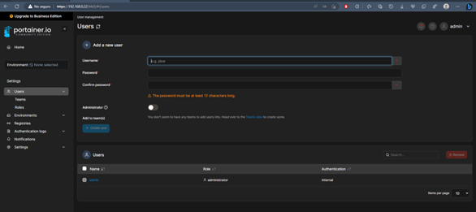
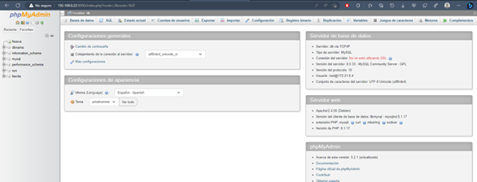
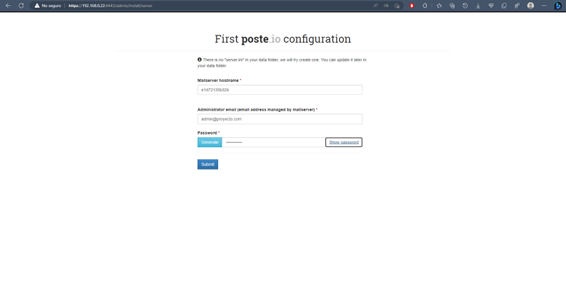
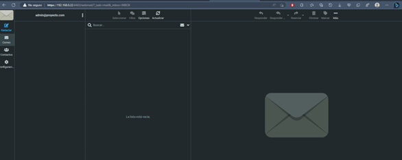
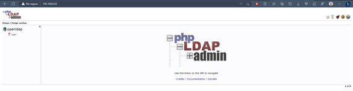
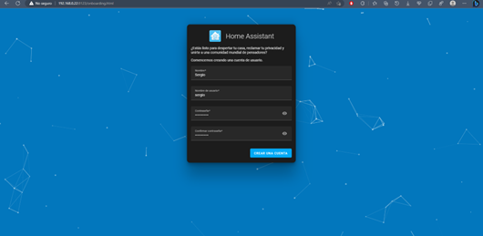
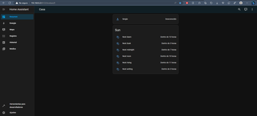

# Contenido Práctico

Para desarrollar el contenido práctico de docker se van a desplegar una serie de contenedores con archivos docker compose en una máquina virtual Ubuntu Server 22.04 LTS. 

## Portainer
Portainer aporta una interfaz gráfica con la que gestionar los diferentes contenedores de docker, se accede por el navegador web en este caso a través del puerto 9443. 

A continuación se puede ver el archivo docker-compose.yaml con el que se ha levantado el contenedor:

```yaml
version: "3"
services:
  portainer:
    image: portainer/portainer-ce:latest
    ports:
      - 9443:9443
    volumes:
      - data:/data
      - /var/run/docker.sock:/var/run/docker.sock
    restart: unless-stopped
volumes:
  data:
```



## Estructura LAMP

LAMP es el acrónimo de "Linux, Apache, MySQL y PHP" y es uno de los sistemas de infraestructura de internet más usado (similar a XAMPP utilizado durante el curso). Para desplegar esta estructura en docker se han utilizado tres contenedore diferentes:

* PHPMyAdmin: Expuesto desde el puerto 8000 en este contenedor se gestionarán las bases de datos que se pueden utilizar a través de PHP comunicandose con otros conetenedores.

* MySQL: Expuesto por el puerto 3306 es el único de los contenedores a los que no se accede directamente, pero es el que se habrá que inidcar junto con la IP como servidor de base de datos en los fichero PHP.

* Apache: Expuesto desde el puerto 80 será el contenedor que muestre el fichero PHP que tenga el nombre de “index.php” (si no existe dará un error).

A continuación se puede ver el archivo docker-compose.yaml utilizado para levantar los contenedores:

```yaml
version: "3.1"
services:
    db:
        image: mysql:8.0
        ports: 
            - "3306:3306"
        command: --default-authentication-plugin=mysql_native_password
        environment:
            MYSQL_DATABASE: dbname
            MYSQL_PASSWORD: test
            MYSQL_ROOT_PASSWORD: test 
        volumes:
            - ./dump:/docker-entrypoint-initdb.d
            - ./conf:/etc/mysql/conf.d
            - persistent:/var/lib/mysql
        networks:
            - default
    www:
        build: .
        ports: 
            - "80:80"
        volumes:
            - ./www:/var/www/html
        links:
            - db
        networks:
            - default
    phpmyadmin:
        image: phpmyadmin/phpmyadmin
        links: 
            - db:db
        ports:
            - 8000:80
        environment:
            MYSQL_USER: root
            MYSQL_PASSWORD: test
            MYSQL_ROOT_PASSWORD: test 
volumes:
    persistent:
```
Y el docker file utilizado para levantar el contenedor apache:

```dockerfile
FROM php:8.0.0-apache
ARG DEBIAN_FRONTEND=noninteractive
RUN docker-php-ext-install mysqli
# Include alternative DB driver
# RUN docker-php-ext-install pdo
# RUN docker-php-ext-install pdo_mysql
RUN apt-get update \
    && apt-get install -y sendmail libpng-dev \
    && apt-get install -y libzip-dev \
    && apt-get install -y zlib1g-dev \
    && apt-get install -y libonig-dev \
    && rm -rf /var/lib/apt/lists/* \
    && docker-php-ext-install zip
RUN docker-php-ext-install mysqli && docker-php-ext-enable mysqli
RUN docker-php-ext-install mbstring
RUN docker-php-ext-install zip
RUN docker-php-ext-install gd

RUN a2enmod rewrite
```




## Poste.io
Poste.io es un servidor de correo electrónico, consta de un único contenedor, y se expone por los puertos 4443 y 8181 pero para funcionar correctamente precisa de siete puertos.

Por otro lado, para poder comunicarse con el protocolo SMTP con otros correos electrónicos se necesita un certificado TLS. En este caso se utilizará “Let’s Encrypt certificate”.

A continuación se puede ver el archivo docker-compose.yaml con el que se han generado el contenedor:

```yaml
version: "3.4"
services:
  poste:
    image: analogic/poste.io
    restart: always
    expose:
      - 25
      - 8181
      - 4443
      - 110
      - 143
      - 465
      - 587
      - 993
      - 995
    volumes:
      - mail:/var/docker/
    networks:
      - default
    environment:
      - HTTPS_PORT=4443
      - HTTP_PORT=8181
      - DISABLE_CLAMAV=TRUE
```





## OpenLDAP

OpenLDAP es una implementación de código abierto del protocolo Lightweight Directory Acces Protocol o protocolo de acceso ligero a directorio en español. Es un protocolo que permite acceder a la información almacenada de forma centralizada en la red. Se utiliza a nivel de aplicación para acceder a los servicios de escritorio remoto.

En este caso, se van a implementar dos contenedores:

* Servidor OpenLDAP: En este contenedor se implementará toda la configuración de este protocolo. Esta expuesto por los puertos 389 y 636.

* PHP_LDAP_Admin: Este contenedor se utilizará para tener una interfaz gráfica con la que gestionar el servidor. Estará expuesto por el puerto 80 por lo que no se puede ejecutar a la vez que la estructura LAMP.

A continuación se puede ver el archivo docker-compose.yaml con el que se levantaron los contenedores:

```yaml
version: '3.7'
services:
  openldap:
    image: osixia/openldap:latest
    container_name: openldap
    hostname: openldap
    ports: 
      - "389:389"
      - "636:636"
    volumes:
      - ./data/certificates:/container/service/slapd/assets/certs
      - ./data/slapd/database:/var/lib/ldap
      - ./data/slapd/config:/etc/ldap/slapd.d
    environment: 
      - LDAP_ORGANISATION=proyecto
      - LDAP_DOMAIN=proyecto.local
      - LDAP_ADMIN_USERNAME=sergio
      - LDAP_ADMIN_PASSWORD=toral
      - LDAP_CONFIG_PASSWORD=toral
      - "LDAP_BASE_DN=dc=proyecto,dc=local"
      - LDAP_TLS_CRT_FILENAME=server.crt
      - LDAP_TLS_KEY_FILENAME=server.key
      - LDAP_TLS_CA_CRT_FILENAME=proyecto.local.ca.crt
      - LDAP_READONLY_USER=true
      - LDAP_READONLY_USER_USERNAME=user-ro
      - LDAP_READONLY_USER_PASSWORD=ro_pass
    networks:
      - openldap
  
  phpldapadmin:
    image: osixia/phpldapadmin:latest
    container_name: phpldapadmin
    hostname: phpldapadmin
    ports: 
      - "80:80"
    environment: 
      - PHPLDAPADMIN_LDAP_HOSTS=openldap
      - PHPLDAPADMIN_HTTPS=false
    depends_on:
      - openldap
    networks:
      - openldap

networks:
  openldap:
    driver: bridge
```



## Homeassistant

El último contendor que se va a implantar en esta parte del trabajo será dedicado a Homeassistant que es una plataforma de domótica de código abierto que permite rastrear y controlar los dispositivos del hogar y automatizar su control.

Consta de un solo contenedor que se expone desde el puerto 8123. A continuación se puede ver el archivo docker-compose.yaml utilizado para levantar el contenedor:

```yaml
version: '3'
services:
  homeassistant:
    container_name: homeassistant
    image: "ghcr.io/home-assistant/home-assistant:stable"
    volumes:
      - ./data:/config
      - /etc/localtime:/etc/localtime:ro
    restart: unless-stopped
    privileged: true
    ports:
      - "8123:8123"
    network_mode: bridge 
```



