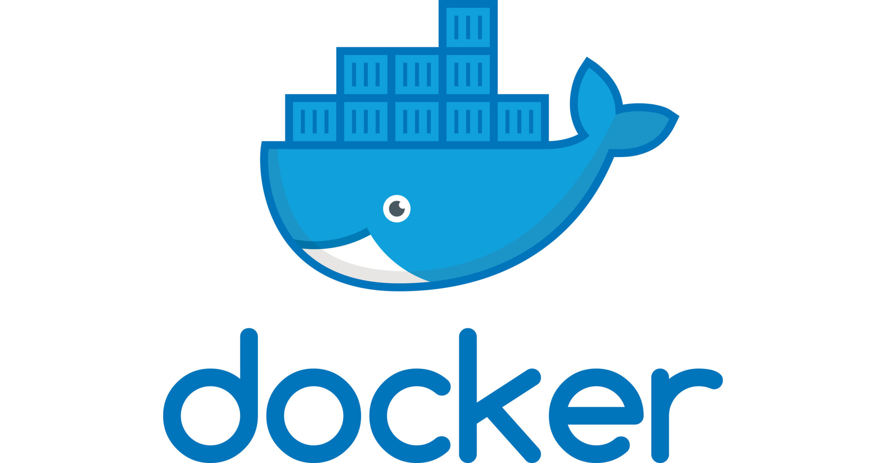

# Docker

Docker es un proyecto de código abierto, bajo licencia apache, escrito en Go y sirve para automatizar el despliegue de aplicaciones dentro de contenedores. Docker fue lanzado en 2008 incorporando una serie de conceptos y herramientas nuevos: 

* Una interfaz de linea de comandos sencilla para ejecutar y diseñar imágenes nuevas en capasa
* Un daemon de servidor.
* Una biblioteca de imágenes prediseñadas.
* Servidor de registro.

Cuando apareció presentaba muchas ventajas, y se extendió rápidamente. Permitiendo construir contenedores con apps, implementarlos, escalarlos y ejecutarlos rápidamente con un consumo mínimo de recursos. Las principales características de docker son:

* Aislamiento del entorno (Sandboxing).
* Control de veriones.
* Agilidad.
* Productividad.
* Eficiencia.

Las ventajas que presenta docker frente a un hipervisor en el que se ejecutan máquinas virtuales son:

* No se reserva memoria, se usa exactamente la que se necesita y se comparte caché con el anfitrión.

* Los contenedores ocupan poco espacio ya que no requieren un Sistema Operativo completo, permitiendo ejecutar muchas variantes del mismo sistema operativo usando guardado diferencial (UnionFS/btrfs,...).

* Se ejecutan contra la CPU directamente, siendo un 50% más rápidos que las máquinas virtuales que necesitan de una capa de traducción.

Uno de los problemas que planteba era la comunicación entre contenedores cuando tuvieran qeu coordinarse o comunicarse entre ellos. Esto empujo a la creación de Docker Swarm y de [Kubernetes](../Kubernetes/).

