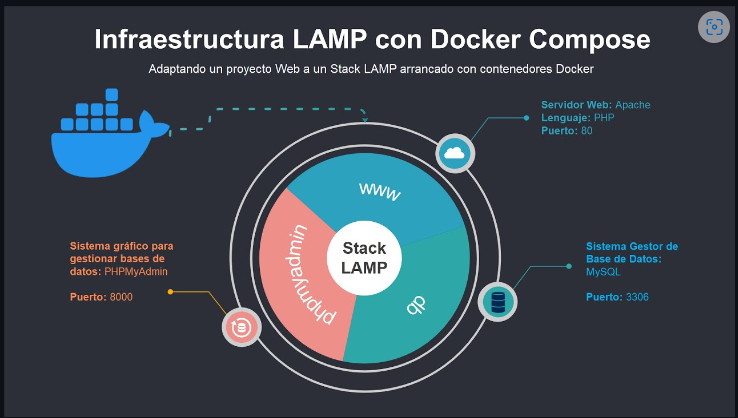

# Estructura LAMP

LAMP es el acrónimo de "Linux, Apache, MySQL y PHP" y es uno de los sistemas de infraestructura de internet más usado.
De está forma se despliegan las tres aplicaciones con los volúmenes necesarios para su correcto funcionamiento. 
La estructura completa se ha copiado del repositorio de github jersonmartinez/docker-lamp utilizando git clone seguido de la URL. Partiendo de esta estructura se va a desplegar una página web de WordPress, una de Moodle y el repositorio de github de este proyecto a html.
