# Contenido práctico

Para realizar las pruebas prácticas de Kubernetes se han probado tres de las alternativas que existen (minikube, kubeadm init y kind) para levantar un clúster local de Kubernetes. Minikube se ha descartado porque se instala en la máquina local y aunque levanta una máquina virtual en la que funcionará el clúster presenta dificultades de portabilidad, es decir, sería difícil hacer la presentación y entrega en USB, además de que funciona como un único nodo. En principio se iba a intentar crear un clúster de varias máquinas virtuales con kubeadm pero el nodo máster aparecía como notReady y no se encontró solución.

Por lo tanto, se ha decidido realizar las pruebas con la herramienta kind (Kubernetes IN Docker) dentro de la máquina virtual con Ubuntu 22.04 LTS que se utilizó previamente para las pruebas con Docker. 

## Instalación kind

Para realizar la instalación hay que ejecutar los siguientes comandos:

```bash
curl -Lo ./kind https://kind.sigs.k8s.io/dl/v0.10.0/kind-linux-amd64
chmod +x ./kind
sudo mv ./kind /usr/local/bin
```

## Arranque clúster local con kind

Una vez instalado kind con el comando `kind create cluster` se creará un clúster de kubernetes con un único nodo. Este clúster presenta varias limitaciones:

* Desde la máquina anfitrion (host) no existe un almacenamiento compartido con el clúster que se encuentra en un único contenedor de docker que hace de nodo.
*  Solo existe un nodo, por lo que, limita la amplitud de las pruebas que se pueden hacer.
* No hay puertos compartidos entre el contenedor que hace de nodo y la máquina anfitrión por lo que no se pueden acceder a los servicios de los pods.

Todos estos problemas se pueden solventar con un fichero yaml en el que se especifiquen los nodos, se comparta almacenamiento y se mapeen algunos puertos entre el host y los nodos. En este caso se va a utilizar el siguiente fichero de configuración (config.yaml):

```yaml
kind: Cluster
apiVersion: kind.x-k8s.io/v1alpha4
nodes:
- role: control-plane
  - hostPath: /home/sergio/compartido
    containerPath: /compartido
- role: worker
  - hostPath: /home/sergio/compartido
    containerPath: /compartido
```

Para poder compartir archivos entre la máquina virtual y los contenedores que actuaran como nodos de Kubernetes es necesario especificar el parámetro extraMounts. Ahora para que se cree el clúster a partir del fichero de configuración anterior habrá que utilizar el mismo comando pero con el parámetro --config=config.yaml. El comando quedaría así:

```bash
kind create cluster --config=config.yaml
```

## Instalación kubectl

Para descargar la última versión de kubectl hay que utilizar el siguiente comando:

```bash
curl -LO "https://dl.k8s.io/release/$(curl -L -s https://dl.k8s.io/release/stable.txt)/bin/linux/amd64/kubectl"
```

Y para instalarla utilizar:

```bash
sudo install -o root -g root -m 0755 kubectl /usr/local/bin/kubectl
```

## Pruebas

Una vez se ha instalado todos los recursos necesarios habrá que comprobar que todo funciona correctamente. Al crear el clúster con kind la salida deberá de ser la siguiente:

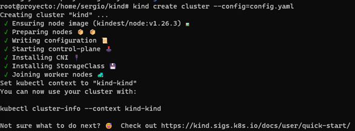

Ahora para comprobar que los nodos estan operativos (STATUS --> Ready) habrá que utilizar el comando kubectl get nodes: 

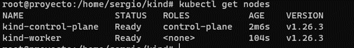

Comprobar con el manifiesto de ejemplo deployment-nginx disponible en [objetos](https://toral24.github.io/Proyecto/Kubernetes/Objetos.html) que se levantan (Ready 1/1) los pods correctamente:

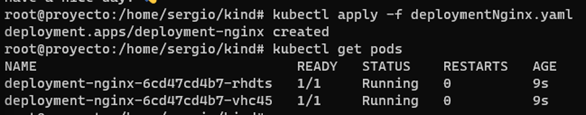

Y que es posible acceder en este caso al servicio de nginx con el comando kubectl port-forward:

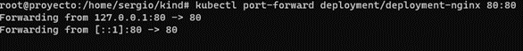

Ahora en el navegador accediendo a localhost desde la máquina virtual se puede comprobar que todo funciona correctamente:

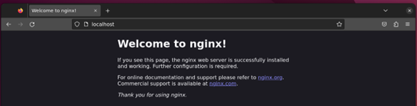

Como útlima prueba se van a modificar los archivos referentes al Persistent Volume y al Persistent Volume Claim para comprobar que se expone el archivo index.html que se ha preparado para esta prube y no el que viene por defecto:

* Persistent volume modificado:

```yaml
apiVersion: v1
kind: PersistentVolume
metadata:
  name: pvlamp
spec:
  storageClassName: manual
  capacity:
    storage: 5Gi
  accessModes:
    - ReadWriteOnce
  persistentVolumeReclaimPolicy: Recycle
  hostPath:
    path: /compartido/html
```

* Persistent volume claim modificado:

```yaml
apiVersion: v1
kind: PersistentVolumeClaim
metadata:
    name: pvclamp
spec:
  storageClassName: manual
  accessModes:
    - ReadWriteOnce
  resources:
    requests:
      storage: 1Gi
```

* Resultado en la página web:

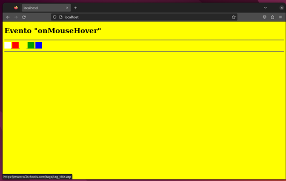

## Instalación de ArgoCD

Para instalar ArgoCD primero se va a crear un namespace que van a utilizar los diferentes objetos (servicios, deployment, ...):

```bash
kubectl create namespace argocd
```

Y ahora con el siguiente comando se van a instalar todos los objetos:

```bash
kubectl apply -n argocd -f https://raw.githubusercontent.com/argoproj/argo-cd/stable/manifests/install.yaml
```

Una vez ejecutados estos comandos si no se ha producido ningún error se puede ver que están disponibles todos los objetos de ArgoCD:

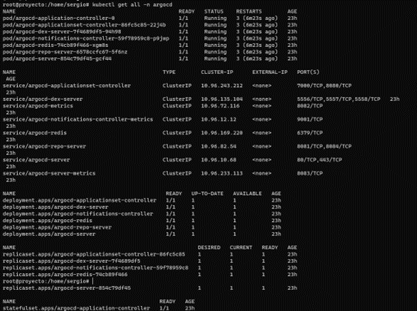

Para poder acceder a a la interfaz gráfica hay que realizar un port-forwarding al servicio de ArgoCD:

```bash
kubectl port-forward svc/argocd-server -n argocd 8080:80
```

Y ya se podría acceder desde el navegador:

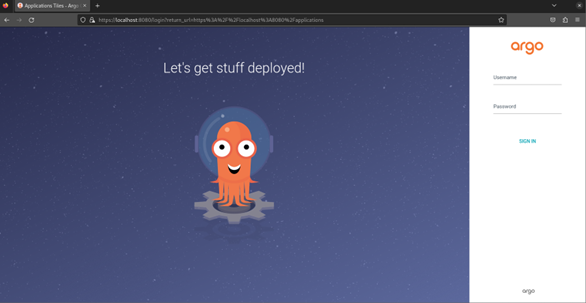

Como se puede ver se pide un usuario y una contraseña, el usuario será **admin** y la contraseña se conseguirá con el siguiente comando (que habrá que ejecutar en una terminal diferente a la que se esta utilizando para realizar el port-forwarding):

```bash
kubectl -n argocd get secret argocd-initial-admin-secret -o jsonpath="{.data.password}" | base64 -d
```

La contraseña en este caso será (todo lo que está antes de root): `lcTtosF-FSDkNZHk`

Ahora introduciendo las credenciales correctamente ya se puede acceder a la aplicación de ArgoCD:

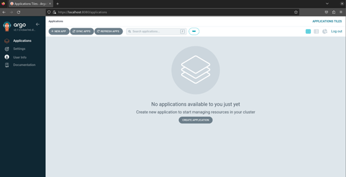

## Instalar Helm y probar chart de Wordpress

Para instalar helm simplemente hay que descargar el script de github para instalarlo, darle permisos de ejecución y ejecutarlo, lo que se traduciría en los siguientes tres comandos:

```bash
curl -fsSL -o get_helm.sh https://raw.githubusercontent.com/helm/helm/main/scripts/get-helm-3
chmod 700 get_helm.sh
./get_helm.sh
```

Una vez instalado helm para añadir la aplicación WordPress en el clúster de kubernetes lo primero hay que buscar el chart correspondiente en el repositorio oficial de charts de helm [artifacthub](https://artifacthub.io/) en el cual se indican los siguientes comandos para instalar la aplicación:

```bash
helm repo add groundhog2k https://groundhog2k.github.io/helm-charts/
helm install my-release groundhog2k/wordpress
```
Por lo que, ahora ya se puede acceder al servicio de WordPress realizanndo un port-forward al servicio que se ha creado con la instalación del chart:

```bash
root@proyecto:/home/sergio/kind# kubectl port-forward svc/my-release-wordpress 8080:80
Forwarding from 127.0.0.1:8080 -> 8000
Forwarding from [::1]:8080 -> 8000
```

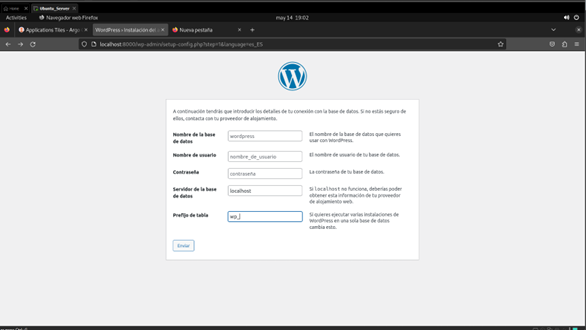

## Instalar cliente de ArgoCD y añadir una aplicación con helm

Para instalar el cliente de ArgoCD hay que ejecutar los siguientes comandos:

```bash
curl -sSL -o argocd-linux-amd64 https://github.com/argoproj/argo-cd/releases/latest/download/argocd-linux-amd64
sudo install -m 555 argocd-linux-amd64 /usr/local/bin/argocd
rm argocd-linux-amd64
```
Y ahora dentro de la aplicación de ArgoCD como se dejó en el punto 3.4.5. seleccionar + NEW APP:

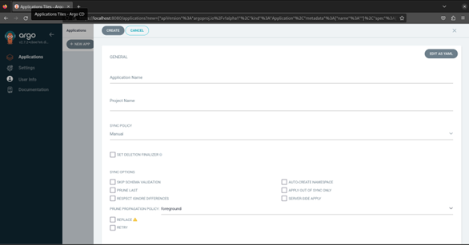

En este caso se va a instalar la aplicación nextcloud, por lo que ,se le dará este nombre, en project name se dejará default y en sync policy automatic, dejando la parte superior de la siguiente forma:

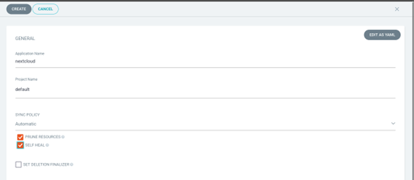

En source habrá que añadir la url donde se encuentra el chart de nextcloud en este caso: https://nextcloud.github.io/helm/

Y en destination dejar el valor que sale al hacer click y namespace default como se puede ver en la siguiente imagen:

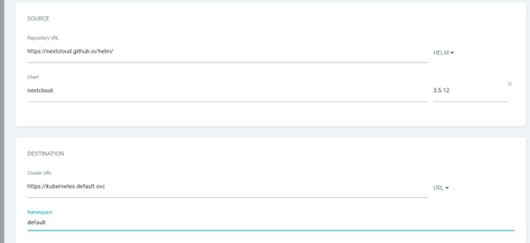

Ahora haciendo clic en create ya se pude ver que la aplicación está corriendo y sincronizada con ArgoCD:

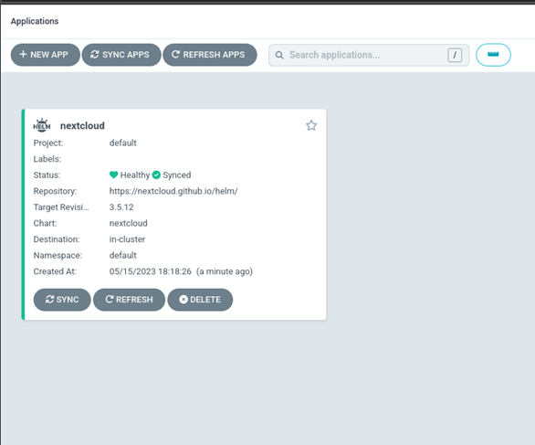

Entrando dentro se pueden ver los objetos que ha creado helm y algunos datos relevantes:

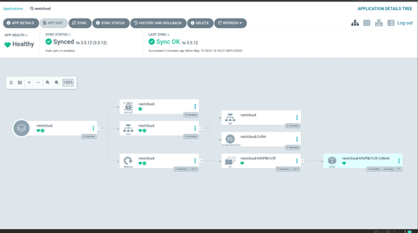

Ahora con un kubectl get all se pueden ver que estos objetos están corriendo dentro del clúster:

```bash
root@proyecto:/home/sergio kubectl get all
NAME                                        READY   STATUS    RESTARTS      AGE
pod/my-release-wordpress-57fc8d5c54-hx2pl   1/1     Running   4 (29m ago)   23h
pod/mysql-74669cc6b5-5xfqd                  1/1     Running   1 (29m ago)   77m
pod/nextcloud-69df9b7c5f-248mk              1/1     Running   0             3m18s

NAME                           TYPE        CLUSTER-IP      EXTERNAL-IP   PORT(S)    AGE
service/kubernetes             ClusterIP   10.96.0.1       <none>        443/TCP    23h
service/my-release-wordpress   ClusterIP   10.96.231.172   <none>        80/TCP     23h
service/mysql                  ClusterIP   None            <none>        3306/TCP   84m
service/nextcloud              ClusterIP   10.96.29.169    <none>        8080/TCP   3m18s

NAME                                   READY   UP-TO-DATE   AVAILABLE   AGE
deployment.apps/my-release-wordpress   1/1     1            1           23h
deployment.apps/mysql                  1/1     1            1           84m
deployment.apps/nextcloud              1/1     1            1           3m18s

NAME                                              DESIRED   CURRENT   READY   AGE
replicaset.apps/my-release-wordpress-57fc8d5c54   1         1         1       23h
replicaset.apps/mysql-74669cc6b5                  1         1         1       77m
replicaset.apps/mysql-79c4686d65                  0         0         0       84m
replicaset.apps/nextcloud-69df9b7c5f              1         1         1       3m18s
```

Ahora con un port-forward se puede acceder a la aplicación desde el navegador:

```bash
root@proyecto:/home/sergio kubectl port-forward svc/nextcloud 8000:8080
Forwarding from 127.0.0.1:8000 -> 80
Forwarding from [::1]:8000 -> 80
```
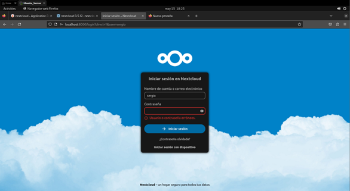

En este caso como se ha utilizado directamente el chart con el repositorio oficial de NextCloud habrá que mirar dentro del archivo values.yaml el usuario y la contraseña, obviamente esto solo es una prueba y lo correcto sería hacer como en el siguiente punto y descargarlo, modificarlo y subirlo a un repositorio propio (utilizando un secret encriptado a ser posible por seguridad).

*	Fichero values.yaml dentro del repositorio de nextcloud:

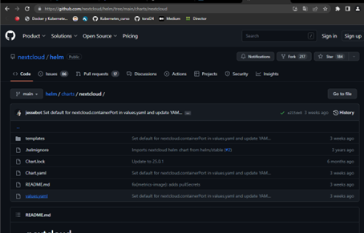

* Usuario y contraseña en archivo values.yaml:

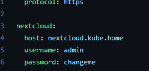

*	Aplicación nextcloud con sesión iniciada:

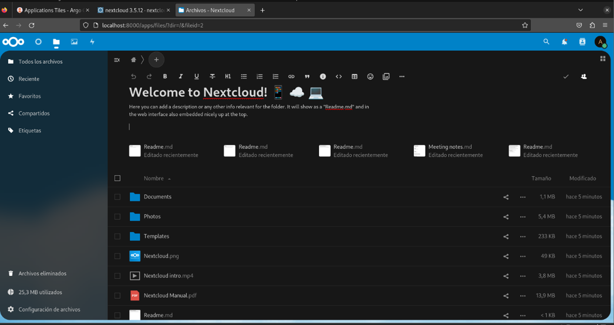

## Crear repositorio con charts de Helm y añadirlos a ArgoCD

Lo primero se va a cambiar la contraseña de Argo CD para que sea siempre, para ello primero hay que iniciar sesión desde la terminal haciendo un port-forward desde una terminal (como se indicó en pasos anteriores) y en la otra utilizando el siguiente comando:
```bash
root@proyecto:/home/sergio# argocd login localhost:8080
WARNING: server certificate had error: x509: certificate signed by unknown authority. Proceed insecurely (y/n)? y
Username: admin
Password: (también se indica en pasos anteriores como conseguir la contraseña)
```

Ahora con el siguiente comando ya se puede actualizar la contraseña:

```bash
root@proyecto:/home/sergio# argocd account update-password
*** Enter password of currently logged in user (admin):
*** Enter new password for user admin:
*** Confirm new password for user admin:
Password updated
Context 'localhost:8080' updated
```

El siguiente paso sería crear un repositorio de GitHub con el nombre de Charts_Helm, seguir las indicaciones para subir le directorio en el que se almacenarán los charts y buscar algunos charts en otros repositorios y copiarlos con git clone URL a este directorio (borrar todos los ficheros y directorios que no estén relacionados con el chart que se quiere utilizar). De esta forma se puede modificar los charts públicos y utilizarlos en AgoCD desde el repositorio propio de GitHub. En este caso se van a crear tres aplicaciones modificando charts:

* <u>Nextcloud:</u> Se va a copiar el chart que se utilizó en el punto anterior modificando las credenciales para comprobar que funciona correctamente. Para ello hay que modificar el fichero values.yaml del repositorio: 

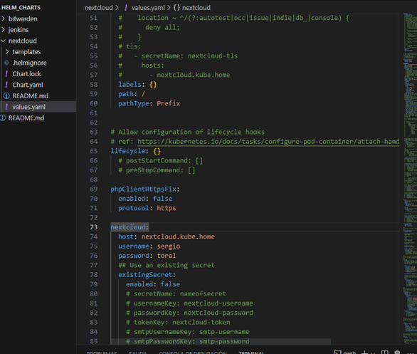

Y ahora realizando el mismo proceso que en el punto anterior (poniendo el repositorio propio) se puede comprobar que utilizando las nuevas credenciales se puede acceder:

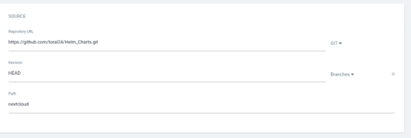

Comprobar que todo ha funcionado correctamente:

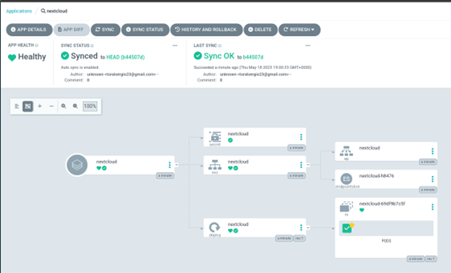

Y ahora realizando un port-forward acceder con las nuevas credenciales:

```bash
root@proyecto:/home/sergio# kubectl port-forward svc/nextcloud 8000:8080
Forwarding from 127.0.0.1:8000 -> 80
Forwarding from [::1]:8000 -> 80
```

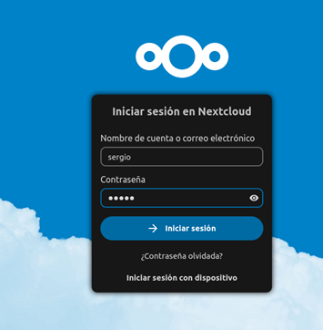

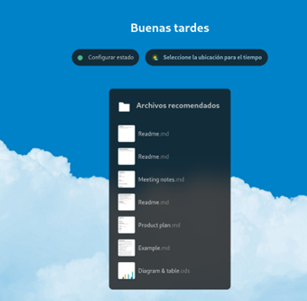

* <u>Jenkins:</u> Jenkins es un servidor de integración continua que es ampliamente utilizado en el sector del desarrollo de software. Permite compilar y probar proyectos de forma continua. 