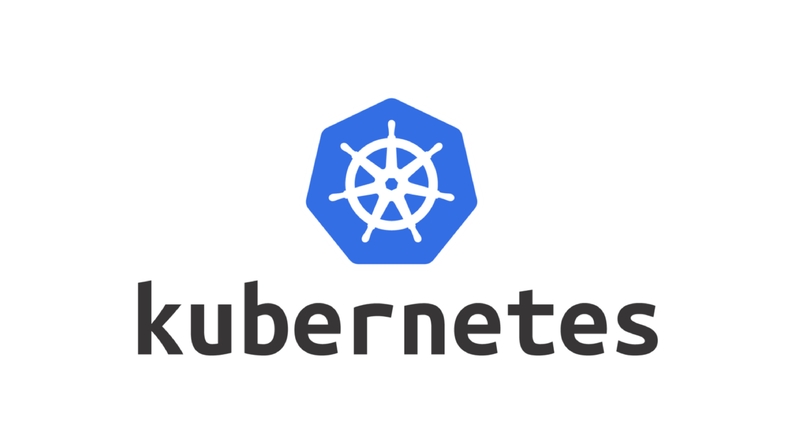

# Kubernetes

## Índice

1. [Docker y Kubernetes. La revolución de los contenedores](../)
2. [Guías bash y vim](../Guias_bash_y_vim/)

    2.1. [Guía bash](../Guias_bash_y_vim/bash.md)

    2.2. [Guía vim](../Guias_bash_y_vim/vim.md)
 
3. [Docker](../Docker/)

    3.1. [Conceptos básicos](../Docker/Conceptos.md)
    
    3.2. [Comandos](../Docker/comandos.md)

4. [Kubernetes](.)

    4.1. [Conceptos básicos](./Conceptos.md)

Kubernetes hace referencia al timonel de un barcon en Esperanto. De ahi el logo, que recuerda a un timón.

Kubernetes es una plataforma de código abierto que se utiliza para administrar contenedores de linux. Se utiliza para implementar, escalar, mantener, programar y operar automáticamente múltiples contenedores de aplicaciones en grupos de nodos.

## Cómo funciona

Kubernetes es un sistema distribuido, en el que las aplicaciones se dividen en dos grupos: 

* **Plano de control** dentro de este se pueden encontrar las siguientes aplicaciones:

    * **kube-apiserver** se encarga de las comunicaciones. Gestiona los permisos entre otras cosas.
    * **kube-scheduler** se asegura de que los recusos se distribuyen de acuerdo a lo especificado.

    * **kube-control-manager** se encarga de tareas administrativas como la gestión de nodos, de trabajos, endpoints.

    * **etcd** es la base de datos donde se guarda todo.

* **Nodo** en este nivel se puede encontrar:
    * **kubelet** es un agente que debe ejecutarse en todos y cada uno de los nodos para permitir la gestión local de acuerdo a lo que diga el scheduler.

    * **kube-proxy** Realiza las tareas de la red.

    * **Container runtime** es el software encargado de ejecutar los contenedores, soporta varios tipos de contenedores (Docker, containerd, cri-o, rktlet y cualquier implementación de la interfaz de runtime de contenedores de Kubernetes).

